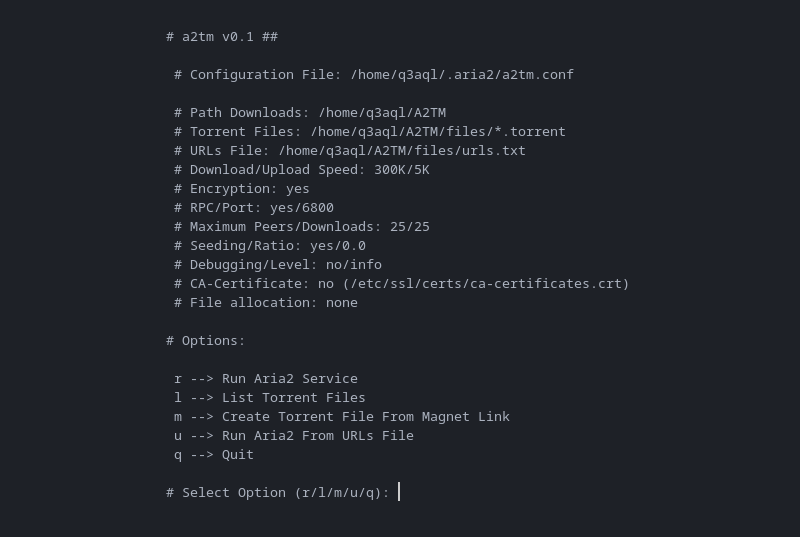

a2tm - aria2 Tool Manager
=========================

a2tm is a python script to manage torrent/magnet/URL downloads more easily using a configuration file.

## Requirements:

- `Python 3.5+`
- `aria2`

### Installation:

  * Open the terminal and type the following comands:
    
    ```shell
    $ git clone https://github.com/asdo92/a2tm
    $ cd a2tm
    $ chmod +x install.sh
    $ sudo ./install.sh
      ````
      
* After running the script, you will see the following:

  ```shell
  # a2tm installer 0.1 (010722) (GPL v2.0)

  + Copied executable (/usr/bin/a2tm).
  + Configuring execution permissions (/usr/bin/a2tm).
  + Created service (/etc/systemd/user/a2tm.service).
  + Installation completed.
  ````
      
### Configuration File:

  * Linux/Unix: `${HOME}/.aria2/a2tm.conf`
  * Windows: `%USERPROFILE%\.aria2\a2tm.conf`
  * MacOS: `${HOME}/.aria2/a2tm.conf`
      
### How to use:

  ```shell
  a2tm
  ````



## Run as service:

  * SysV Init: `/etc/init.d/a2tm {start|stop|restart|status}`
  * SystemD: `systemctl --user {start|stop|status} a2tm`

### External links:

  * [Python homepage](https://www.python.org/)
  * [aria2 homepage](https://aria2.github.io/)
  * [aria2 static builds](https://github.com/asdo92/aria2-static-builds)
